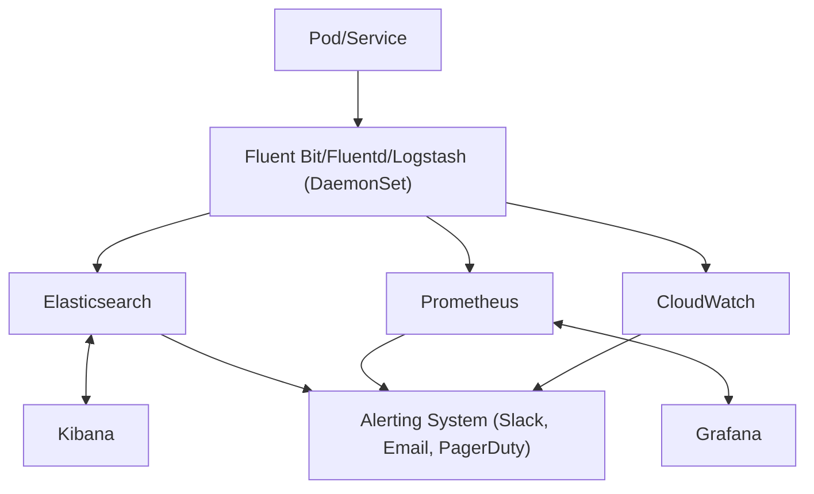

# EKS 기반 Kubernetes 클러스터 로그 통합 관리 아키텍처

## 1. 전체 구조 개요

EKS 기반 Kubernetes 환경에서 마이크로서비스별로 발생하는 다양한 로그(애플리케이션, 시스템, 인프라)를 통합적으로 수집, 전처리, 시각화, 알림까지 관리하는 구조는 다음과 같습니다.



## 2. 로그 수집 단계

- **로그 에이전트(Fluent Bit, Fluentd, Logstash 등)**를 DaemonSet으로 각 노드에 배포하여, 컨테이너 표준 출력(stdout/stderr) 및 파일 로그를 수집합니다.
- **수집 대상**: 애플리케이션 로그, 시스템 로그, Kubernetes 이벤트 로그 등
- **수집 방식**: Sidecar 패턴, Node-level DaemonSet, 또는 애플리케이션 내 직접 전송

## 3. 로그 전처리 단계

- **필터링**: 불필요한 로그 제거, 민감 정보 마스킹, 레벨별(Log Level) 필터링
- **구조화**: JSON, key-value 등 일관된 포맷으로 변환
- **태깅**: 서비스명, 네임스페이스, Pod 이름, 환경(dev/stage/prod) 등 메타데이터 추가
- **집계**: 일정 주기별로 로그를 집계하거나, 이벤트 기반으로 집계

## 4. 로그 저장 및 시각화

- **Elasticsearch/CloudWatch**: 대용량 로그 저장 및 검색
- **Prometheus**: 메트릭성 로그(에러 카운트, 응답 시간 등) 수집 및 시각화
- **Grafana**: Prometheus, Elasticsearch, CloudWatch 등 다양한 데이터 소스와 연동하여 대시보드 시각화
- **Kibana**: Elasticsearch와 연동하여 로그 검색, 분석, 시각화

### 시각화 흐름 예시
- **Prometheus**: 애플리케이션에서 메트릭을 Exporter로 노출 → Prometheus가 주기적으로 수집 → Grafana에서 대시보드로 시각화
- **Elasticsearch + Kibana**: Fluent Bit/Fluentd가 로그를 Elasticsearch로 전송 → Kibana에서 검색/분석/시각화

## 5. 서비스별 로그 형태 설계 방안

- **JSON 포맷 권장**: 구조화된 로그로 검색/분석 용이
- **공통 필드 정의**: timestamp, level, service, namespace, pod, trace_id, message 등
- **에러/이벤트 구분**: 에러, 경고, 정보, 디버그 등 레벨 구분
- **트랜잭션/트레이스 ID**: 분산 트레이싱을 위한 필드 포함(OpenTelemetry 등과 연계)
- **샘플 로그 예시**:
```json
{
  "timestamp": "2024-06-01T12:34:56Z",
  "level": "ERROR",
  "service": "user-api",
  "namespace": "prod",
  "pod": "user-api-1234abcd",
  "trace_id": "abc123xyz",
  "message": "DB connection timeout"
}
```

## 6. 로그 집계 주기 및 알림 설정 방안

- **집계 주기**
  - 실시간(Streaming): 에러, 장애 등 주요 이벤트는 실시간 집계 및 전송
  - 주기적(Batch): 1분/5분/10분 단위로 집계하여 대시보드에 반영
- **알림 설정**
  - Grafana Alert, Kibana Watcher, CloudWatch Alarm 등 활용
  - 임계치(Threshold) 기반: 에러율, 응답 지연, 특정 이벤트 발생 시 알림
  - Slack, Email, PagerDuty 등 외부 시스템 연동
  - 예시: 5분간 에러 로그 10건 이상 발생 시 Slack 알림 전송

## 7. 참고 아키텍처 다이어그램 (Mermaid)

위의 mermaid 다이어그램을 참고하여 전체 로그 흐름을 시각적으로 이해할 수 있습니다.

---

이 구조를 기반으로 서비스별 로그 표준화, 집계 및 알림 정책을 수립하면, 장애 대응 및 운영 효율성을 크게 높일 수 있습니다. 